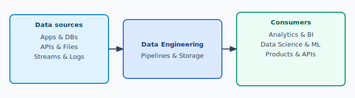
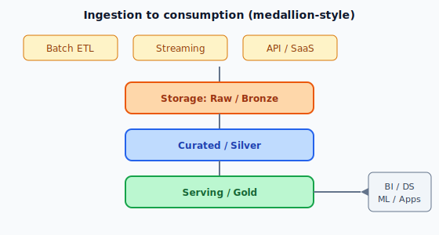

# What is Data Engineering?

> **Learning objectives:** Define data engineering; compare it to related roles; name core responsibilities and typical tools; relate to business value.

---

## 1. Definition

**Data engineering** is the discipline of **designing, building, and operating** systems that:

- **Collect** data from many sources  
- **Store** it reliably and cost-effectively  
- **Transform** it into a **clean, consistent, usable** form  
- **Deliver** it to **analysts, data scientists, applications, and ML models** on time  

In short: data engineers make data **available, trustworthy, and scalable** for the rest of the organization.

---

## 2. Why Data Engineering Exists

| Problem | Without strong data engineering | With data engineering |
|--------|--------------------------------|------------------------|
| Data scattered everywhere | Manual exports, inconsistent reports | Central pipelines and governed datasets |
| Slow or failed analytics | Analysts wait or fix bad data | Reliable tables and SLAs |
| ML that never ships | Scientists stuck on plumbing | Feature stores, training data ready |
| Cost and risk | Duplicate storage, unclear lineage | Efficient storage, auditability |

---

## 3. Data Engineering vs Related Roles

*Figure: Data flows from sources through data engineering to consumers.*

| Role | Primary focus | Typical outputs |
|------|----------------|-----------------|
| **Data engineer** | Reliable **pipelines**, **warehouses/lakes**, **quality**, **ops** | Tables, streams, datasets, infrastructure |
| **Data analyst** | **Questions**, **dashboards**, **reports** | Insights, KPIs, visualizations |
| **Data scientist** | **Models**, **experiments**, **statistics** | Models, analyses |
| **ML engineer** | **Serving**, **MLOps**, **production ML** | Deployed models, monitoring |
| **Software engineer** | **Applications** and **services** | Features, APIs (may produce data as side effect) |

**Overlap:** Everyone touches data sometimes; data engineers own the **platform and flow** of data end-to-end.

---

## 4. Core Responsibilities (Typical)

1. **Ingestion** – Batch jobs, CDC, streaming connectors, API pulls  
2. **Storage** – Data lakes, warehouses, lakehouses; partitioning; retention  
3. **Transformation** – Cleaning, joining, aggregations; dimensional modeling  
4. **Orchestration** – Scheduling, dependencies, retries, alerting  
5. **Quality** – Validation rules, monitoring, anomaly detection  
6. **Metadata & lineage** – Catalogs, documentation, impact analysis  
7. **Security & governance** – Access control, PII handling, compliance  
8. **Performance & cost** – Query tuning, right-sized clusters, storage tiers  

---

## 5. Typical Architecture (Conceptual)

*Figure: Ingestion → storage layers (bronze / silver / gold) → consumption.*

Many teams use **medallion** or **bronze/silver/gold** naming: raw → cleaned → business-ready.

---

## 6. Skills Landscape (Introduction Level)

| Area | Examples |
|------|----------|
| **Programming** | Python, SQL, sometimes Scala/Java |
| **SQL** | Queries, window functions, modeling |
| **Data stores** | Relational DBs, warehouses (e.g. Snowflake, BigQuery), lakes (S3 + Parquet) |
| **Orchestration** | Airflow, Dagster, cloud schedulers |
| **Streaming** | Kafka, Flink, Spark Streaming (awareness) |
| **Formats** | CSV, JSON, Parquet, Avro |
| **Cloud** | AWS/GCP/Azure basics (storage, compute, IAM) |
| **Soft skills** | Working with stakeholders, documenting, on-call mindset |

---

## 7. Summary

- **Data engineering** = **reliable movement and refinement of data** at scale.  
- It **enables** analytics and ML by fixing **plumbing, quality, and scale** first.  
- It is **distinct** from analytics and DS but **collaborates** closely with them.

---

## Further Reading (Optional)

- *Fundamentals of Data Engineering* (Joe Reis & Matt Housley) – architecture and practice  
- Cloud provider **data engineering** learning paths (AWS, GCP, Azure)
