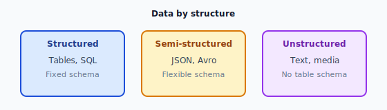
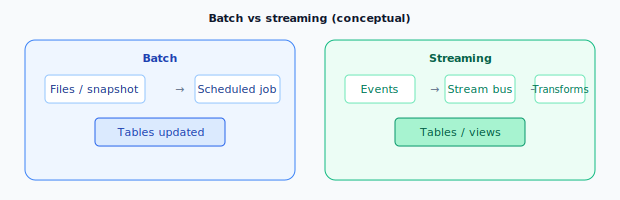

# Data Lifecycle and Data Types

> **Learning objectives:** Describe stages of the data lifecycle; classify data by structure and velocity; relate types to storage and processing choices.

---

## 1. What is the Data Lifecycle?

The **data lifecycle** is the journey data takes from creation to archival or deletion. Data engineering implements **systems for each stage**.

### 1.1 High-level lifecycle

*Figure: Typical stages from generation through archive and deletion.*

| Stage | Meaning | Engineering concern |
|-------|---------|------------------------|
| **Generate** | Data created by apps, sensors, users | Schemas, event design |
| **Collect / Ingest** | Move data into the platform | Connectors, frequency, errors |
| **Store** | Persist in lake/warehouse/DB | Format, partitioning, cost |
| **Process / Transform** | Clean, join, aggregate | Pipelines, idempotency, SLAs |
| **Use** | BI, ML, operational use | Access, performance, freshness |
| **Archive / Delete** | Retention, compliance | Lifecycle policies, legal holds |

---

## 2. Another View: Pipeline Stages (Medallion)

Common in lake/warehouse projects:

*Figure: Medallion stages — raw → cleaned → curated.*

- **Bronze:** As close to source as possible (append-only, audit trail).  
- **Silver:** Conformed, deduplicated, typed, joined across sources.  
- **Gold:** Business aggregates, metrics, star schemas for BI/ML.

---

## 3. Data Types by Structure

### 3.1 Structured data

- **Definition:** Fixed schema, rows and columns (tables).  
- **Examples:** Relational tables, most CSVs with stable headers.  
- **Pros:** Easy to query with SQL; mature tooling.  
- **Cons:** Schema changes need migration or evolution strategy.

### 3.2 Semi-structured data

- **Definition:** Self-describing or flexible schema (nested, optional fields).  
- **Examples:** JSON, XML, many NoSQL documents.  
- **Pros:** Flexible for evolving APIs and events.  
- **Cons:** Harder to query without flattening or semi-structured SQL extensions.

### 3.3 Unstructured data

- **Definition:** No inherent tabular schema.  
- **Examples:** Text, images, audio, video, PDFs, free-form logs.  
- **Pros:** Captures rich real-world information.  
- **Cons:** Needs NLP, OCR, or metadata extraction for analytics.

*Figure: Three common structural categories.*

---

## 4. Data Types by Velocity (How Fast It Arrives)

| Type | Description | Examples | Typical processing |
|------|-------------|----------|---------------------|
| **Batch** | Data arrives in **chunks** on a schedule | Daily exports, hourly snapshots | Scheduled ETL, Spark batch |
| **Streaming / Near real-time** | **Continuous** events | Clickstream, IoT, logs | Kafka + Flink, micro-batches |
| **Real-time (strict)** | **Low latency** required | Fraud detection, live dashboards | Stream processing, specialized stores |

**Lambda / Kappa** architectures are patterns for combining batch and stream (introductory awareness is enough here).

---

## 5. Logical Data Types (In Databases and Files)

When we say “data type” in engineering, we often mean **column types**:

| Family | Examples | Notes |
|--------|----------|--------|
| **Numeric** | INTEGER, BIGINT, FLOAT, DECIMAL | Precision matters for money (use DECIMAL). |
| **String / text** | VARCHAR, STRING | Length limits, encoding (UTF-8). |
| **Boolean** | TRUE/FALSE | Watch for NULL vs false. |
| **Datetime** | TIMESTAMP, DATE, TIME | Time zones are critical (store UTC + TZ). |
| **Binary** | BYTES, BLOB | Images, serialized objects. |
| **Complex** | ARRAY, MAP, STRUCT | Common in big data engines (Spark, BigQuery). |

---

## 6. Data Quality Dimensions (Brief)

Lifecycle and **types** connect to **quality**:

- **Completeness** – Missing values?  
- **Accuracy** – Matches reality?  
- **Consistency** – Same meaning across systems?  
- **Timeliness** – Fresh enough for the use case?  
- **Uniqueness** – Duplicates controlled?  
- **Validity** – Conforms to rules and types?  

Data engineers often implement **checks** at Silver/Gold stages.

---

## 7. Summary

- **Lifecycle:** generate → ingest → store → transform → use → archive/delete.  
- **By structure:** structured vs semi-structured vs unstructured.  
- **By velocity:** batch vs streaming vs real-time.  
- **Logical types** and **quality dimensions** guide how you store and validate data.

---

## Diagram: Batch vs Streaming (Conceptual)

*Figure: Batch (scheduled jobs) vs streaming (continuous events).*
