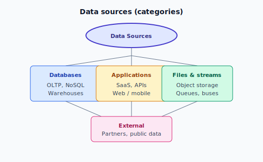
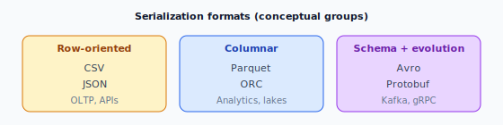

# Data Sources and Data Formats

> **Learning objectives:** List common data sources and how pipelines connect to them; compare file and serialization formats; choose formats for analytics vs interchange.

---

## 1. Data Sources (Where Data Comes From)

### 1.1 Categories



*Figure: Common source groups — databases, applications, files & streams, external.*

---

## 2. Common Source Types (Detail)

| Source type | Examples | Typical access |
|-------------|----------|----------------|
| **Relational OLTP** | PostgreSQL, MySQL, SQL Server | JDBC, replication, CDC |
| **Data warehouse** | Snowflake, BigQuery, Redshift | SQL, ELT tools, native connectors |
| **NoSQL** | MongoDB, Cassandra, DynamoDB | APIs, CDC, batch export |
| **Object storage** | S3, ADLS, GCS | Files (CSV, Parquet, JSON lines) |
| **SaaS** | Salesforce, HubSpot | REST APIs, managed connectors |
| **Logs & telemetry** | App logs, clickstream | Agents → Kafka / object storage |
| **IoT** | Sensors | MQTT → gateway → stream or batch |

**CDC (Change Data Capture):** Captures **inserts/updates/deletes** from databases into the lake/warehouse with low latency—common in modern data engineering.

---

## 3. Data Formats (How Data is Serialized)

Formats affect **size**, **speed**, **schema evolution**, and **tool compatibility**.

### 3.1 Text / row-oriented

| Format | Pros | Cons | Typical use |
|--------|------|------|-------------|
| **CSV** | Human-readable, universal | No standard types; quoting issues; poor compression | Simple exports, spreadsheets |
| **JSON** | Flexible, web-native | Verbose; nested data can be heavy | APIs, configs, semi-structured events |
| **JSON Lines (JSONL)** | One JSON object per line | Easier to stream than one big array | Logs, NDJSON ingestion |

### 3.2 Columnar (analytics-optimized)

| Format | Pros | Cons | Typical use |
|--------|------|------|-------------|
| **Parquet** | Columnar, compressed, schema embedded | Not human-readable in raw form | **Data lakes, warehouses, Spark** |
| **ORC** | Columnar, good for Hive | Less universal outside Hadoop ecosystem | Hive, some on-prem lakes |

**Rule of thumb:** For **large analytical** tables, **Parquet** (or native warehouse format) is preferred over CSV.

### 3.3 Row-based binary with schema

| Format | Pros | Cons | Typical use |
|--------|------|------|-------------|
| **Avro** | Compact, **schema evolution**, good for Kafka | Binary | Streaming pipelines, registry-based contracts |
| **Protocol Buffers** | Compact, cross-language | Needs codegen | gRPC, internal services |

---

## 4. Comparing Formats (Conceptual)



*Figure: Typical groupings — row-oriented (CSV, JSON), columnar (Parquet, ORC), schema evolution (Avro, Protobuf).*

- **Row-oriented:** Good for **single-row** reads/writes (OLTP, APIs).  
- **Columnar:** Good for **aggregations and scans** (analytics).  
- **Avro:** Good for **streaming** with **schema registry**.

---

## 5. Choosing a Format (Decision Hints)

| Scenario | Suggested direction |
|----------|---------------------|
| Exchange with humans / Excel | CSV (with care), or Parquet + BI tool |
| REST API payload | JSON |
| Data lake “bronze” from apps | JSON/JSONL or Avro in Kafka |
| Data lake “silver/gold” for SQL/Spark | **Parquet** |
| Kafka topics with evolving schema | **Avro** + Schema Registry (common pattern) |
| Long-term archival, compliance | Org-specific; often compressed Parquet + encryption |

---

## 6. Compression (Often Paired with Formats)

| Codec | Notes |
|-------|--------|
| **Snappy, LZ4** | Fast compress/decompress; common default with Parquet |
| **Gzip** | Higher compression; slower—common for CSV/JSON in object storage |
| **Zstandard (zstd)** | Good balance; increasingly popular |

---

## 7. Example: Same Record, Different Packaging (Illustrative)

**CSV (header + row):**
```text
id,name,price
1,Apple,1.50
```

**JSON:**
```json
{"id": 1, "name": "Apple", "price": 1.5}
```

**Parquet:** Binary columnar file—not meant to be read as text; schema is stored inside the file.

---

## 8. Summary

- **Sources** span databases, SaaS, files, streams, and partners—access patterns include batch, API, and CDC.  
- **Formats** trade off readability, size, analytics performance, and streaming fit.  
- **Parquet** is the default choice for **analytics** on lakes; **JSON** for **APIs**; **Avro** often for **Kafka** with schemas.

---

## Hands-on (See `examples/`)

- `read_sample_formats.py` – Reading CSV and JSON in Python (conceptual).  
- `formats_comparison.md` – Quick reference table (optional).
